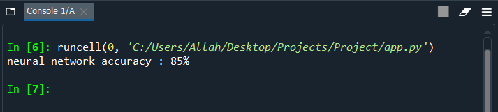

# Dataset
10,000 records of bank customers data
# Neural network
takes 8 inputs which is bank customers data such as gender and current account balance

3 hidden layers which each layer consists of 10 nodes

return 1 output which answer the question **"will the customer leave the bank in the future ?"**
# Calculate the accuracy of neural network

